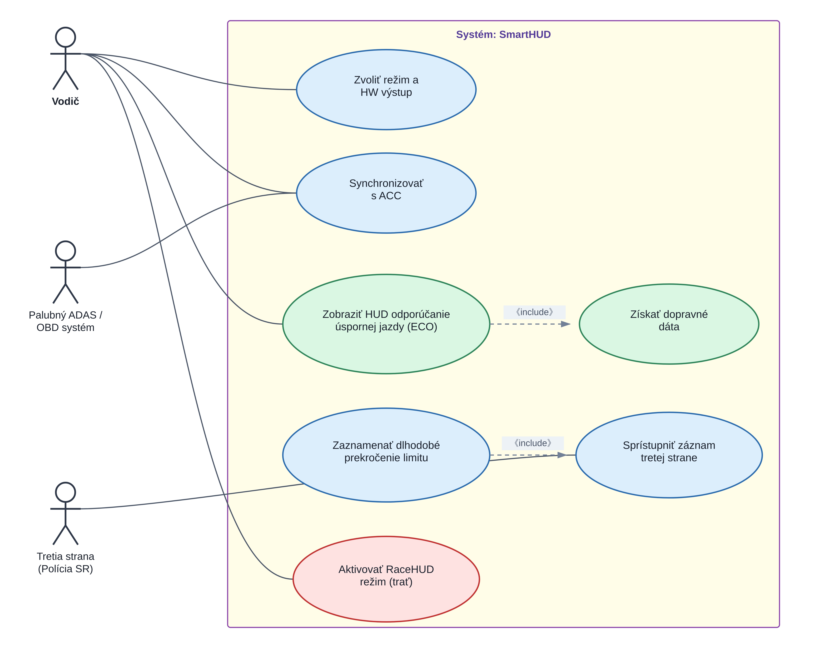
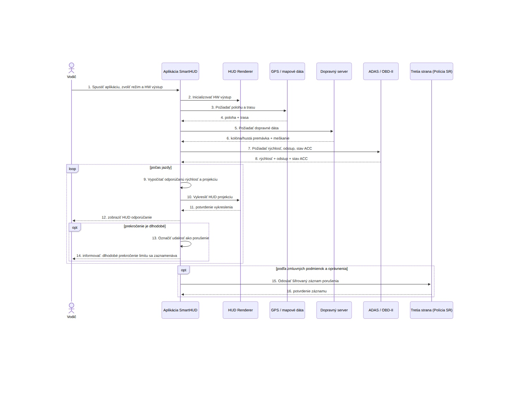
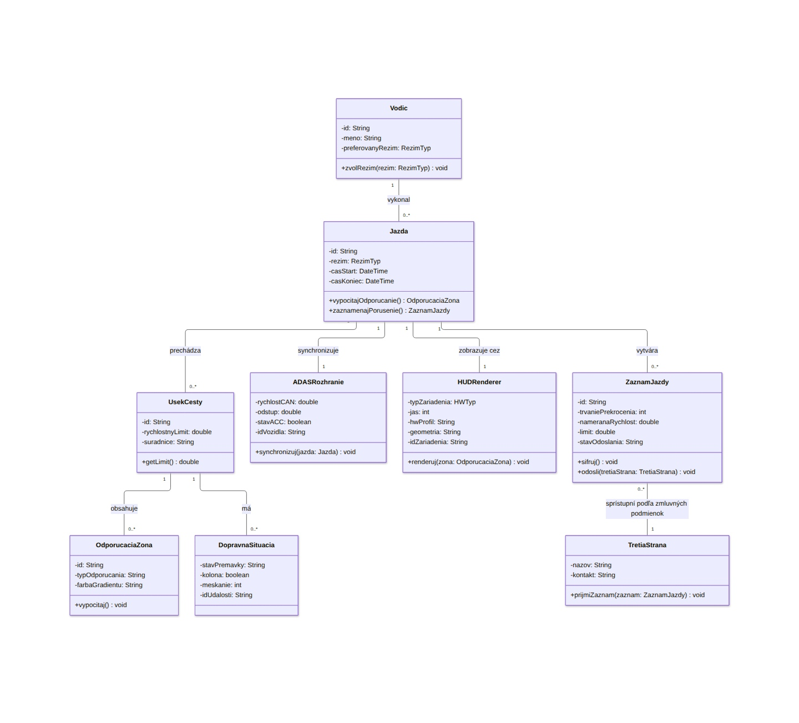
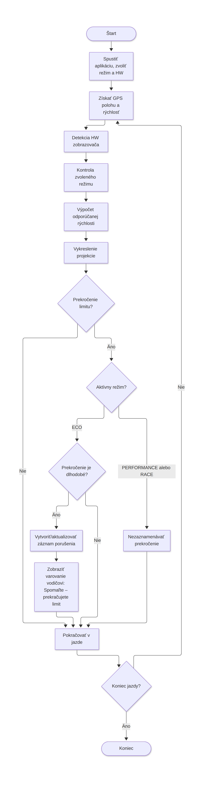
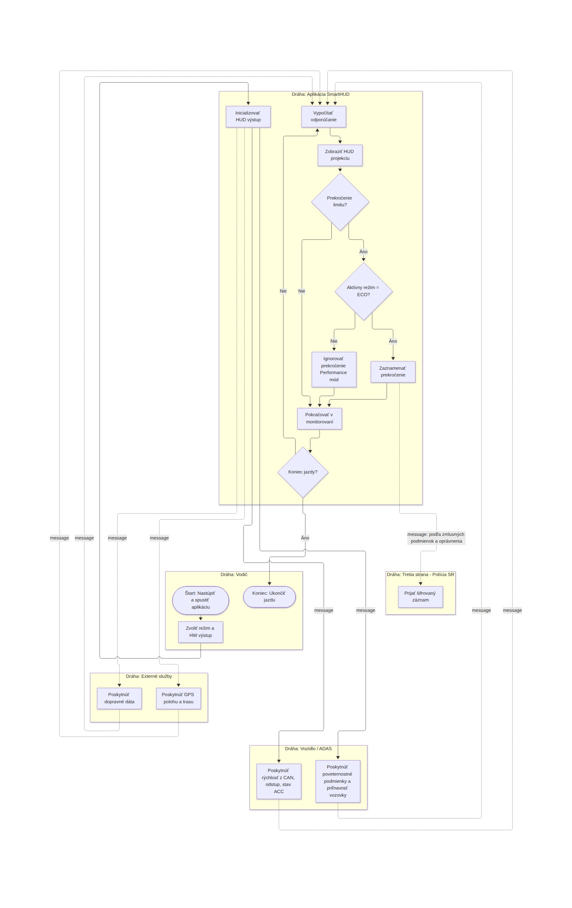

# SmartHUD – Prediktívny HUD asistent s nastaviteľnými režimami

**Názov projektu:** SmartHUD – Prediktívny HUD asistent pre plynulú jazdu, monitoring bezpečnosti a športovú jazdu (ECO / RACE / PERFORMANCE)

**Meno riešiteľa:** Matúš Paškala

**Login:**

## Seznam kapitol - částí projektu

1. Úvod
2. Dôvod a okolnosti zavedenia riešenia
3. Popis projektu (slovné zadanie, popis od zákazníka)
4. Analýza požiadaviek
5. Systémové požiadavky (FURPS)
6. Kritické situácie
7. Hranice systému
8. Kontext prostredia
9. Charakteristika aktérov
10. Use Case diagram
11. Scenáre (Implementácia Use Case)
12. Sekvenčný diagram
13. Triedny diagram
14. Aktivitný diagram
15. BPMN diagram
16. Wireframe kľúčových obrazoviek
17. Záver

## Popis zmien v dokumente

**Východisková špecifikácia:** Vytvorenie kompletného počiatočného návrhu systému SmartHUD vrátane integrácie troch jazdných režimov (ECO, RACE, PERFORMANCE).

**Hardvérová modularita:** Definícia flexibilného rozhrania zahŕňajúceho základnú 2D variantu (mobilný telefón / samostatný 2D HUD projektor proti prehrievaniu) a prémiovú variantu s laserovým AR-HUD projektorom a 3D šípkami.

**Architektúra a diagramy:** Vypracovanie kompletných systémových požiadaviek, scenárov, Use Case, sekvenčných, triednych, aktivitných a BPMN diagramov pre celú logiku projektu vrátane bezpečnostného modulu.

**Verzia 1.5 (táto verzia):** Oprava UML notácie vo všetkých piatich diagramoch podľa spätnej väzby – odstránenie nesprávneho `<<extend>>` vzťahu, zjednotenie štýlu elíps, nahradenie voľného textu štandardnými stereotypmi, oprava smeru asociácií a duplicitných atribútov v triednom diagrame, doplnenie multiplicít, oprava viditeľnosti atribútov, oprava návratových správ v sekvenčnom diagrame, oprava cieľa slučky v aktivitnom diagrame a doplnenie gateway v BPMN diagrame.

## 1. Úvod

SmartHUD je pokročilý asistenčný a bezpečnostný systém pre vodičov, ktorý kombinuje funkcie pre plynulú, úspornú a športovú jazdu. Systém ponúka tri plne nastaviteľné a prepínateľné jazdné režimy:

- **ECO Mód:** Určený pre každodennú plynulú a úspornú jazdu v cestnej premávke s aktívnym vyhodnocovaním bezpečnosti.
- **PERFORMANCE Mód:** Určený pre dynamickú jazdu a špeciálne autorizované účely (napr. služobné vozidlá Polície SR v akcii).
- **RACE Mód (RaceHUD):** Špecializovaný traťový režim pre navádzanie na brzdné body a ideálnu stopu na uzavretých pretekárskych okruhoch.

Systém podporuje flexibilné úrovne hardvérového rozhrania:

- **Základná verzia (Basic / Light 2D):** Ponúka dve hardware alternatívy pre zobrazenie farebného gradientu a piktogramov:
  - *Varianta A (Smartfón + 2D reflexná podložka):* Cenovo najdostupnejšie riešenie využívajúce displej telefónu.
  - *Varianta B (Základný samostatný 2D HUD projektor):* Dedikovaná dostupná zobrazovacia jednotka pripojená k telefónu/OBD, ktorá kompletne rieši a eliminuje riziko prehrievania smartfónu počas letných dní.
- **Prémiová verzia (Premium Laser AR-HUD):** Využíva drahšiu verziu aplikácie v kombinácii so špeciálnym laserovým AR-HUD projektorom, ktorý vo všetkých troch režimoch (ECO, PERFORMANCE, RACE) premieta navádzanie vo forme plynulej sekvencie 3D farebných šípok priamo na povrch vozovky.

V bežnej premávke je dodržiavanie rýchlosti monitorované; pri dlhodobom a hrubom porušení predpisov sa vyhotoví šifrovaný záznam pre **Dopravnú políciu SR / Tretiu stranu**.

## 2. Dôvod a okolnosti zavedenia riešenia

Klasické navigácie a palubné počítače vyžadujú odvracanie zraku od cesty. SmartHUD prenáša len najdôležitejšie informácie (spomalenie, zóna brzdenia, kolóna, limit) priamo do zorného poľa – či už ako 2D reflexný obraz (cez zrkadliaci telefón alebo samostatný 2D projektor), alebo ako laserová 3D projekcia na vozovku.

Zavedenie samostatného 2D HUD projektora v základnej verzii priamo odpovedá na prevádzkové riziko prehrievania mobilných telefónov umiestnených za čelným sklom na priamom slnku. Možnosť voľby režimu jazdy (ECO / PERFORMANCE / RACE) robí systém univerzálnym a prítomnosť bezpečnostného modulu naviac pôsobí preventívne proti agresívnej jazde na verejných komunikáciách.

## 3. Popis projektu (slovné zadanie, popis od zákazníka)

Projekt je zameraný na vývoj inteligentnej aplikácie s podporou HUD projekcie s nasledujúcimi funkciami:

- **Nastaviteľnosť režimov:** Vodič si v aplikácii zvolí aktívny režim podľa situácie (ECO, PERFORMANCE, RACE).
- **Modulárne a flexibilné HUD rozhranie:** Podpora pre zrkadlenie smartfónu, samostatný slabší 2D HUD projektor (prevencia prehriatia telefónu), ako aj prémiový laserový AR projektor s 3D šípkami na vozovke.
- **Prepojenie s vozidlom:** Zber dát z GPS, dopravných serverov, OBD-II zbernice a adaptívneho tempomatu (ACC).
- **Dohľad a bezpečnosť:** Generovanie záznamov porušení rýchlosti pre Políciu SR pri jazde v ECO móde.

## 4. Analýza požiadaviek

### Funkčné požiadavky

- Možnosť voľby aktívneho režimu (ECO / PERFORMANCE / RACE) v používateľskom rozhraní.
- Renderovanie 2D zrkadleného HUD (telefón alebo samostatný 2D projektor) alebo 3D laserových šípok na vozovku (podľa HW verzie).
- Priebežné určovanie polohy, rýchlosti a smeru vozidla.
- Prijímanie informácií o kolónach a rýchlostných meškaniach.
- Čítanie a synchronizácia s adaptívnym tempomatom (ACC) a CAN zbernicou.
- Vytvorenie a šifrované uloženie záznamu porušenia rýchlosti pre Políciu SR pri dlhodobom prekročení v ECO móde.

### Nefunkčné požiadavky

- Obnovovacia frekvencia zobrazenia min. 5–10 Hz (pre laserový AR-HUD až 30 Hz).
- Latencia spracovania do 200 ms.
- Tepelná odolnosť základnej verzie vďaka alternatíve so samostatným 2D HUD projektorom.
- Vysoká čitateľnosť laserových šípok aj počas jasného dňa.
- Kryptografická ochrana neporušiteľnosti záznamov pre Políciu SR.

### Zoznam modulov projektu a ich atribútov

- **Modul správcu režimov (Mode Selector):** Aktívny režim, stav autorizácie, ID relácie.
- **Modul HUD projekcie (2D Smartfón / 2D HUD Projektor / Laser AR-HUD):** Typ zariadenia, jas, HW profil, 3D/2D geometria, ID zariadenia.
- **Modul GPS a mapových dát:** Poloha, rýchlosť, trasa, rýchlostný limit, ID úseku.
- **Modul dopravných informácií:** Stav premávky, kolóna, meškanie, ID udalosti.
- **Modul ADAS / OBD-II integrácie:** Rýchlosť z CAN, odstup, stav ACC, ID vozidla.
- **Modul záznamu porušení (Polícia SR):** Trvanie prekročenia, nameraná rýchlosť, limit, stav odoslania, ID záznamu.
- **Modul fyziky a podmienok (Performance & RaceHUD):** Priľnavosť, počasie, stav bŕzd, brzdné body, ID traťového profilu.

## 5. Systémové požiadavky (FURPS)

| **Kategória**            | **Požiadavka**                                                                                                                                                                                           |
| ------------------------ | ----------------------------------------------------------------------------------------------------------------------------------------------------------------------------------------------------------- |
| **Funkčnosť (F)**        | - Tri prepínateľné režimy (ECO, PERFORMANCE, RACE). - Podpora dvoch základných 2D HW alternatív (telefón+podložka / samostatný 2D projektor) a prémiovej laserovej AR verzie. - Prepojenie s ADAS/ACC. - Záznam porušenia rýchlosti pre Políciu SR v ECO móde. |
| **Použiteľnosť (U)**     | - Intuitívne prepínanie režimov pred jazdou. - Odstránenie rizika prehrievania telefónu voľbou dedikovaného 2D projektora.                                                                            |
| **Spoľahlivosť (R)**     | - Hardware fail-over (prepnutie z laseru na 2D projektor alebo telefón). - Šifrovaný lokálny sklad pre záznamy porušení.                                                                              |
| **Výkon (P)**            | - Latencia < 200 ms, obnovovacia frekvencia až 30 Hz pre laserovú projekciu.                                                                                                                             |
| **Schopnosť údržby (S)** | - Modulárna podpora rôznych typov displejov a HUD projektorov prostredníctvom jednotného rozhrania.                                                                                                      |

## 6. Kritické situácie

### Systémové

- **Prehriatie smartfónu:** V základnej verzii sa toto riziko efektívne eliminuje prepnutím na alternatívny samostatný 2D HUD projektor, ktorý funguje nezávisle od displeja telefónu a zvláda vysoké teploty na palubnej doske.
- **Zlyhanie laserového AR projektora:** Systém sa automaticky prepne do záložného 2D režimu (na samostatný 2D projektor alebo na displej telefónu).
- **Strata GPS signálu:** Dočasné pozastavenie zobrazenia AR šípok/gradientu a zobrazenie varovania pre vodiča.

### Aplikačné

- **Ochrana spotrebiteľa a upozornenie:** Jasné poučenie vodiča, že v ECO móde sa nadmerné prekročenie limitu zaznamenáva pre Políciu SR.
- **Detekcia neoprávneného použitia Race módu:** Ak je RaceHUD zapnutý na verejnej ceste, GPS automaticky aktivuje štandardné rýchlostné limity a monitoring.

## 7. Hranice systému

- **Ideálny stav:** Plne funkčný Laser AR-HUD (alebo samostatný 2D projektor bez rizika prehriatia), GPS, live dopravné dáta a aktívne CAN/ACC prepojenie.
- **Základný stav (Alternatíva 1):** Samostatný 2D HUD projektor pre stálu prevádzku v horúčavách.
- **Základný stav (Alternatíva 2):** Smartfón na 2D zrkadlovej podložke. Zobrazuje sa farebný gradient a ikonové výstrahy.
- **Mimo hraníc:** Absolútna strata signálu (napr. dlhý podzemný tunel) bez OBD-II snímania. Aplikácia bezpečne preruší projekciu.

## 8. Kontext prostredia

Aplikácia pracuje v interiéri vozidla spojená s telefónom, reflexnou podložkou, samostatným 2D HUD projektorom alebo pokročilým laserovým AR projektorom. Prostredníctvom bezdrôtových a káblových sietí komunikuje s mapovými servermi, ADAS jednotkou vozidla a rozhraním pre **Dopravnú políciu SR / Tretiu stranu**.

## 9. Charakteristika aktérov

- **Vodič:** Primárny používateľ vyžadujúci prehľadné navádzanie, voľbu HW zobrazenia a voľbu režimu (ECO / PERFORMANCE / RACE).
- **Palubný ADAS / OBD systém:** Poskytuje telemetrické dáta z vozidla (rýchlosť, odstup, stav tempomatu).
- **Tretia strana (Dopravná polícia SR):** Prijímateľ správ pri zistení závažného a dlhodobého prekročenia limitov na verejných cestách.

## 10. Use Case diagram

Diagram zobrazuje aktérov (Vodič, ADAS, Tretia strana / Polícia SR) a hlavné prípady použitia.

## 11. Scenáre (Implementácia Use Case)

### Scenár 1: Zobraziť HUD odporúčanie (ECO Mód)

Vodič jazdí v premávke. Systém vypočíta odporúčanú rýchlosť a zobrazí ju cez zrkadlený telefón, samostatný 2D HUD projektor alebo 3D laserové šípky. Ak vodič dlhodobo prekračuje limit, vygeneruje sa záznam pre Políciu SR.

### Scenár 2: Synchronizovať s adaptívnym tempomatom (ACC)

Systém sa prepojí s CAN zbernicou a prispôsobuje farebné indikácie nastavenej rýchlosti a odstupu tempomatu.

### Scenár 3: Aktivovať PERFORMANCE / RACE Mód

Vodič zvolí športový režim. Systém vynechá obmedzenia rýchlosti (pri schválení/na okruhu) a zobrazuje navádzanie ideálnej stopy a brzdných bodov.

## 12. Sekvenčný diagram

Znázorňuje časový priebeh od inicializácie, cez výber HW výstupu, výber režimu, periodický zber dát, výpočet projekcie až po prípadné vytvorenie a odoslanie záznamu porušenia Polícii SR.

## 13. Triedny diagram

Objektový model obsahujúci triedy Jazda, HUDRenderer, ADASRozhranie, ÚsekCesty, DopravnáSituácia, OdporúčaciaZóna, ZáznamJazdy, Vodič a TretiaStrana.

## 14. Aktivitný diagram

Rieši vývojový diagram: Získanie polohy -> Detekcia HW zobrazovača -> Kontrola zvoleného režimu -> Výpočet rýchlosti -> Vykreslenie projekcie -> Vyhodnotenie prekročenia limitu -> Správa záznamu.

## 15. BPMN diagram

Procesné dráhy (Vodič, Aplikácia SmartHUD, Vozidlo/ADAS, Externé služby, Tretia strana - Polícia SR) popisujúce tok správ a riadenia pri používaní systému s podporou rôznych HW rozhraní.

## 16. Wireframe kľúčových obrazoviek

1. **Nastavenie režimov a HW:** Výber ECO / PERFORMANCE / RACE a voľba HW výstupu (Displej telefónu / Samostatný 2D HUD projektor / Laser AR-HUD).
2. **Basic 2D HUD (Telefón / 2D Projektor):** Zrkadlené/priame rozhranie s farebným gradientom odporúčanej rýchlosti.
3. **Premium Laser AR-HUD:** Vizualizácia 3D farebných šípok premietaných priamo na cestu pred autom.
4. **Diagnostika a ADAS:** Správa pripojenia k OBD-II, 2D projektoru a ACC.

## 17. Záver

SmartHUD vo verzii 1.5 predstavuje kompletné, vysoko prispôsobivé riešenie. Spája tri plnohodnotné režimy jazdy s trojúrovňovou hardvérovou variabilitou (dostupná 2D podložka pre telefón, samostatný 2D HUD projektor riešiaci problém s prehrievaním smartfónu a prémiový Laserový AR-HUD s 3D šípkami na vozovke). Vďaka transparentnej spolupráci s **Dopravnou políciu SR** v bežnej premávke výrazne zvyšuje bezpečnosť a plynulosť cestnej premávky. Oproti verzii 1.4 boli navyše opravené všetky nedostatky UML notácie identifikované v spätnej väzbe vo všetkých piatich diagramoch.

